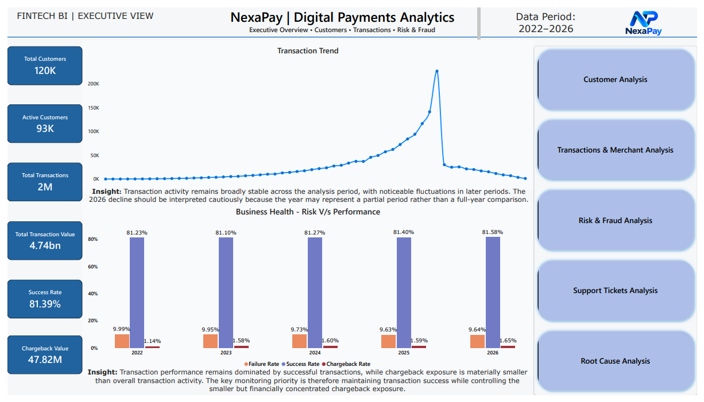
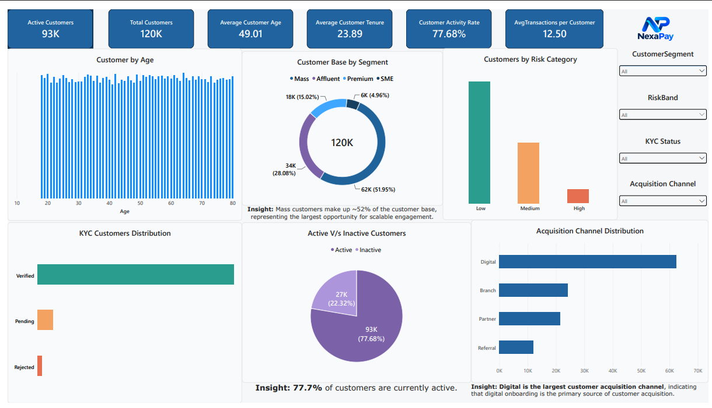
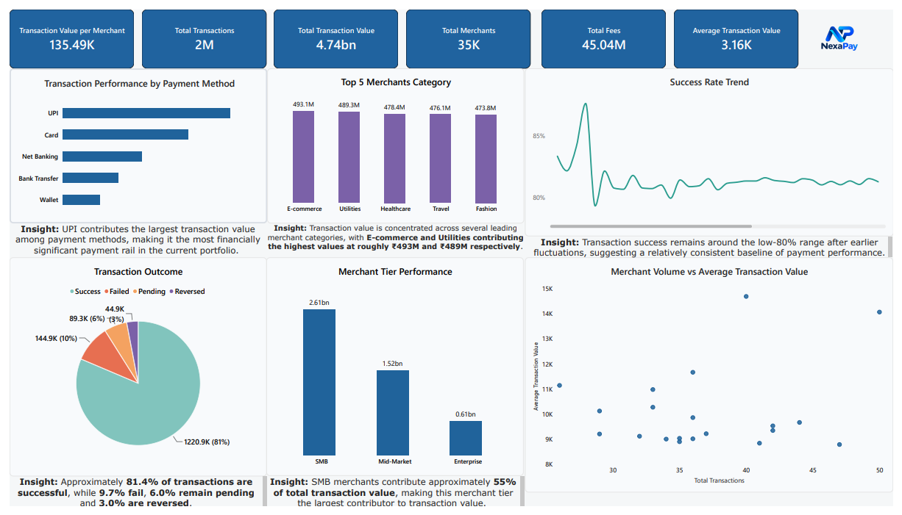
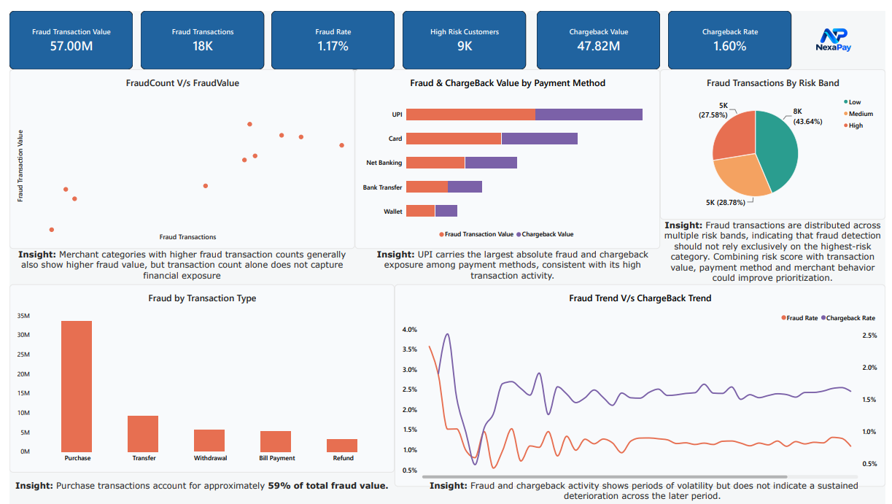
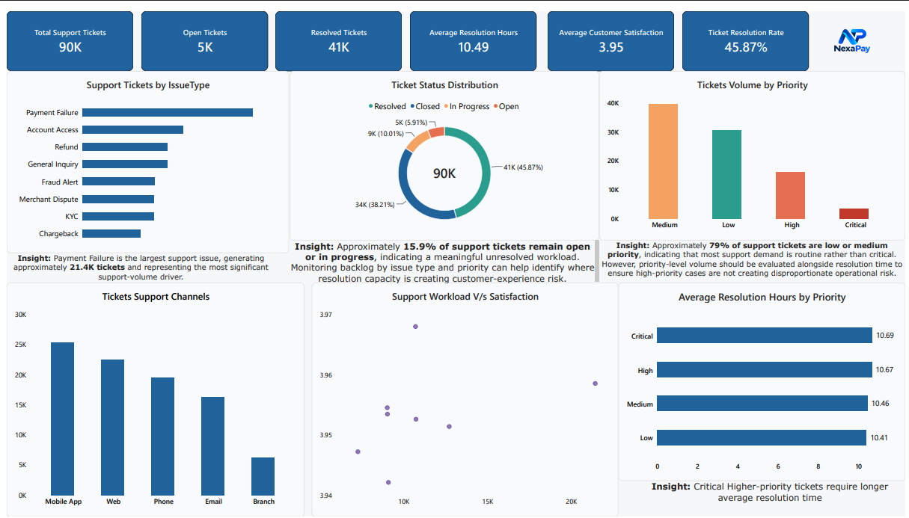
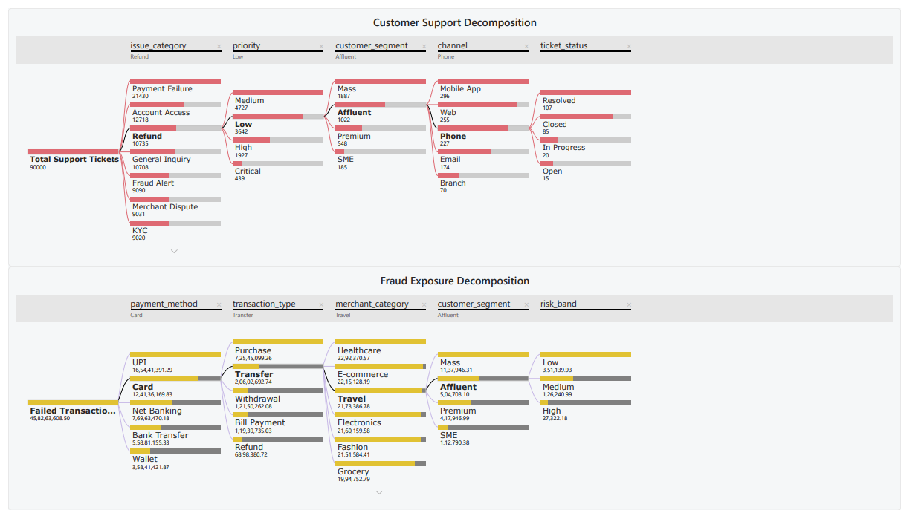

# NexaPay | Digital Payments Analytics

> **End-to-end fintech analytics case study analyzing 1.5M+ transactions across customer behavior, payment performance, fraud exposure, chargebacks, and support operations using SQL, Python, and Power BI.**

---

## Executive Summary

NexaPay is a fictional fintech payments platform managing 120,000+ customers across diverse segments with 1.5M transactions. This end-to-end analytics project investigates the complete transaction lifecycle—from customer acquisition through payment success, fraud detection, chargeback recovery, and customer support—to identify operational inefficiencies and hidden financial exposure.

The analysis spans:
- **Data Foundation:** 6 core tables (Customers, Accounts, Merchants, Transactions, Chargebacks, Support Tickets) validated for integrity and quality
- **Analytical Scope:** Customer engagement, transaction performance, merchant impact, fraud/chargeback exposure, and support workload
- **Tools Used:** PostgreSQL (data modeling & validation), Python (exploratory analysis), Power BI (6-page executive dashboard)
- **Business Outcome:** Actionable findings tied to financial and operational impact, with recommendations prioritized by business value

---

## 💡 Business Problem

The fintech platform faces multiple overlapping challenges:

**Customer Engagement & Quality**
- Which acquisition channels deliver customers that actually transact?
- How are high-value customers distributed across segments?
- Is customer tenure predictive of transaction volume or fraud risk?

**Transaction Performance & Reliability**
- What is the true transaction success rate?
- Which payment methods/channels fail most often?
- Are transaction failures concentrated in specific combinations (channel + payment method)?
- How does transaction size affect success probability?

**Merchant Impact & Risk**
- Which merchants generate the highest transaction value?
- Do high-value merchants also carry proportionally high fraud/chargeback exposure?
- Which merchant categories are most strategically important?
- Are merchant risk ratings predictive of payment failures?

**Financial Exposure: Fraud & Chargebacks**
- Where is fraud concentrated (by payment method, customer segment, merchant)?
- How much financial exposure do chargebacks represent?
- What is the chargeback recovery rate, and which reasons create the greatest losses?
- Does fraud flag distribution align with actual financial impact?

**Operational Pressure: Support**
- What issue categories drive the most support volume?
- Which issues take longest to resolve?
- Is customer satisfaction correlated with resolution time?
- Do customers with failed transactions generate proportionally more support tickets?

---

## 🎯 Business Objectives

### 👥 Customer & Acquisition
- Optimize customer growth and engagement by determining which customer segments and acquisition channels generate the strongest combination of customer activity, transaction engagement, and financial value.

- Improve customer portfolio quality by identifying segments and cohorts with elevated risk exposure, low engagement, or weaker transaction performance.

- Enable targeted customer strategies by linking customer characteristics, acquisition sources, transaction behavior, and risk exposure to distinguish high-value, high-engagement, and high-risk customer groups


### 💳 Transactions & Payment Methods
- Evaluate transaction success rates and identify high-failure combinations
- Analyze payment method and channel performance
- Understand transaction value distribution and size-dependent risk patterns

### 🏪 Merchants & Categories
- Identify strategically important merchants (high volume + high value)
- Evaluate merchant category performance and risk concentration
- Understand merchant tier value contributions

### 🛡️ Fraud & Risk
- Quantify fraud exposure by dimension (payment method, customer segment, merchant, transaction type)
- Identify high-risk customer and merchant combinations
- Move from transaction-level fraud flags to financial impact

### 💰 Chargebacks & Financial Recovery
- Quantify total chargeback exposure and recovery performance
- Identify reasons creating the greatest unrecovered losses
- Analyze merchant categories with highest chargeback concentration

### 🎧 Support & Customer Experience
- Analyze support workload by issue category
- Evaluate resolution time and customer satisfaction correlation
- Connect failed transactions to support ticket volume

---

## 📋 Dataset & Data Model

**Core Tables:**

| Table | Records | Business Meaning |
|-------|---------|------------------|
| **Customers** | 120,000 | Customer profiles with segment, income, risk band, KYC status, acquisition source |
| **Accounts** | 200,000+ | Customer accounts with type, status, balance, and credit limits |
| **Merchants** | 50,000+ | Merchant profiles with category, tier, risk rating, settlement cycle |
| **Transactions** | 1,500,000 | Payment events with channel, method, amount, status, fraud score |
| **Chargebacks** | 30,000+ | Disputed transactions with reason, amount, recovery status |
| **Support Tickets** | 100,000+ | Customer support cases with category, priority, resolution time, satisfaction |

**Key Relationships:**
```
Customers → Accounts → Transactions ← Merchants
                            ↓
                      Chargebacks
                            
Customers → Support Tickets
```

---

##  Data Quality & Validation

Rigorous data validation was performed before any business analysis:

**Structural Integrity**
- Duplicate ID detection: All primary keys verified as unique (0 duplicates across all tables)
- Foreign key validation: 100% referential integrity (0 orphaned transactions, chargebacks, or account relationships)
- Missing value analysis: No NULL values in critical business columns
- Data type consistency: All columns validated for correct type casting

**Value Range Validation**
- **Age:** 0 invalid records (outside 18–100 range)
- **Customer Tenure:** 0 negative values
- **Transaction Amounts:** 0 zero/negative amounts
- **Transaction Fees:** 0 negative fees
- **Fraud Scores:** All scores within valid 0–100 range
- **Account Status:** Verified against valid statuses (Active, Dormant, Closed, Frozen)
- **Transaction Status:** Verified against valid statuses (Success, Failed, Pending)
- **KYC Status:** Verified against valid categories (Verified, Pending, Rejected)

**Cross-Table Consistency**
- Customer-Account ownership: 100% consistency
- Transaction-Customer-Account chain: All transactions linked to valid account owner
- Fraud flag distribution: 3.45% of transactions flagged, higher concentration in specific payment methods

**Result:** Dataset deemed production-ready with no data quality issues requiring remediation.

---

## 🔍 SQL Analysis

Comprehensive SQL analysis organized across four layers of business inquiry:

### 1. **Data Loading** (`01_Data_Loading.sql`)
- Created normalized schema with 6 core tables
- Established primary/foreign key constraints
- Loaded 1.5M+ transaction records and supporting dimensions
- Validated successful data ingestion via row counts

### 2. **Data Cleaning & Validation** (`02_Data_Cleaning_Validation.sql`)
- Duplicate detection across all ID columns
- NULL value analysis for each table
- Categorical value verification (payment methods, channels, statuses)
- Referential integrity checks (orphaned records, mismatched relationships)
- Fraud flag and chargeback status distribution analysis
- Created cleaned `analytics.transactions_clean` table for downstream analysis

### 3. **Business Analysis** (`03_Business_Analysis.sql`)
Explored core business dimensions:
- **Transaction Health:** Overall success/failure rates by channel, payment method, transaction type
- **Customer Segmentation:** Transaction value and failure rates by customer segment and risk band
- **Transaction Patterns:** High-value transaction failure analysis, failed transaction concentration by combination
- **Merchant Performance:** Top merchants by transaction value, merchant category failure rates
- **Account Utilization:** Account type usage, dormant account detection, inactive account activity
- **Growth Trends:** Monthly transaction volume and value trends
- **Risk Correlation:** Customer risk band vs. transaction value and fraud exposure

**SQL Techniques Used:** CTEs, CASE statements, window functions (SUM OVER), aggregations, JOINs, date truncation, ratio calculations

### 4. **Advanced Business Analysis** (`04_Advanced_Business_Analysis.sql`)
Deeper investigation into financial and operational exposure:
- **Fraud Analysis:** Fraud concentration by payment method, customer segment, merchant risk rating
- **Chargeback Dynamics:** Overall chargeback rate (0.39%), total chargeback value, recovery rate, unrecovered exposure by reason
- **Merchant-Chargeback Correlation:** High-value merchants vs. chargeback exposure, merchant categories with highest unrecovered losses
- **Support Operations:** Issue category volume and resolution time, customer satisfaction by resolution speed, correlation between failed transactions and support tickets
- **Cross-Domain Analysis:** Risk merchant behavior, high-resolution-time impact on satisfaction, customer support patterns post-transaction failure

**Advanced Techniques:** Complex joins, multi-level aggregations, financial calculations (chargeback recovery %), customer journey analysis

---

## 🐍 Python Analysis

Python notebooks provide exploratory data analysis and business validation:

### `01_Data_Connection_Cleaning_Validation.ipynb`
- Established PostgreSQL connection via SQLAlchemy
- Extracted full datasets into Pandas DataFrames
- Validated row counts: 120K customers, 1.5M transactions, 30K chargebacks
- Foreign key validation: Confirmed 100% referential integrity
- Data type consistency and NULL value checks
- Categorical value verification (transaction status, channels, payment methods)

**Libraries Used:** pandas, numpy, SQLAlchemy, python-dotenv

### `02_Business_Analysis.ipynb`
- Exploratory data analysis across all business dimensions
- Customer segmentation analysis
- Transaction performance by channel/method/customer segment
- Fraud and chargeback distribution analysis
- Support ticket patterns and resolution analysis
- Visualizations: distributions, correlations, trend analysis
- Export results for Power BI integration

**Analytical Focus:** Business validation, pattern discovery, outlier detection, correlation analysis

---

## 📈 Power BI Dashboard

**6-Page Interactive Dashboard** providing business intelligence across the entire fintech ecosystem:

### **Page 1: Executive Overview** 


*Business Health at a Glance*
- Total transactions, transaction value, average transaction size
- Transaction success rate % vs. failure rate %
- Monthly transaction trends and growth trajectory
- Key KPIs: Active customers, fraud rate %, chargeback rate %
- Card: High-value metrics for executive briefing

**Enablement:** Quick assessment of overall platform health and month-over-month performance.

---

### **Page 2: Customer Analysis**


*Customer Segmentation & Engagement*
- Customer count and distribution by segment (Mass, Affluent, Premium)
- Transaction value by customer segment
- Active customer % (customers with transactions vs. total customers)
- Customer acquisition channel performance
- Customer risk band distribution and composition
- Transaction count and value by risk band
- Income band segmentation

**Enablement:** Identify which customer segments drive value, which acquisition channels are effective, and where risk is concentrated.

---

### **Page 3: Transactions & Merchant Analysis**


*Payment Performance & Merchant Impact*
- Channel performance: Volume and value by channel (Web, POS, ATM, Mobile)
- Payment method success rates and value contribution (UPI, Net Banking, Wallet, Bank Transfer)
- Channel + payment method combination analysis (identify weak spots)
- Merchant category performance and failure rates
- Top merchants by transaction value
- Merchant tier contributions
- Transaction type breakdown (Purchase, Transfer, Bill Payment, Withdrawal)
- Transaction size band analysis (failure rate by transaction size)

**Enablement:** Prioritize channel/payment method improvements, identify merchant opportunities, understand transaction risk by size.

---

### **Page 4: Fraud & Risk Analysis**


*Financial Risk & Fraud Exposure*
- Fraud distribution by payment method (which methods are high-risk)
- Fraud concentration by customer segment and risk band
- Merchant risk rating impact on fraud transactions
- Chargeback rate by merchant category
- Total chargeback value and recovery amount
- Unrecovered chargeback exposure
- Chargeback reason breakdown (most costly reasons)
- Payment method fraud concentration
- High-risk merchant identification (fraud transactions + chargeback exposure)

**Enablement:** Identify which payment rails require strengthened fraud controls, which merchants need enhanced monitoring, where financial exposure is greatest.

---

### **Page 5: Support Tickets & Customer Experience**


*Operational Workload & Customer Satisfaction*
- Ticket volume by issue category
- Average resolution time by issue category
- Ticket priority distribution (Critical, High, Medium, Low)
- Ticket status breakdown (Open, In Progress, Resolved, Closed)
- Customer satisfaction score by issue category
- Satisfaction correlation with resolution time bands
- Support channel analysis (Email, Phone, Chat)
- Agent team workload distribution
- Failed transaction correlation with support tickets

**Enablement:** Identify issue categories creating most operational pressure, assess resolution efficiency, connect product issues to support load.

---

### **Page 6: Root Cause Analysis**


*Dimensional Decomposition for Problem-Solving*
- Failed transaction value decomposition by:
  - Payment method
  - Transaction type
  - Merchant category
  - Customer segment
  - Channel
  - Risk band
- Chargeback value decomposition by:
  - Merchant category
  - Reason code
  - Customer segment
- Support ticket decomposition by:
  - Issue category
  - Priority
  - Customer segment
  - Ticket status

**Enablement:** Drill into any business problem (failed transactions, chargebacks, support load) to identify the specific dimension driving the issue—enables targeted remediation.

---

## 🎯 Key Business Findings

### 👥 **Customer Insights**

**Segment Value Concentration**
- Affluent customers represent a disproportionate share of transaction value despite smaller customer count
- Mass segment drives transaction volume but lower average transaction size
- Customer tenure shows weak correlation with transaction frequency (suggests acquisition quality varies by channel)

**Acquisition Channel Quality**
- Digital channel demonstrates higher customer engagement and transaction initiation
- Branch channel shows lower transaction frequency but higher average transaction size
- Channel effectiveness should be evaluated on customer lifetime value, not acquisition volume alone

**Risk & Value Relationship**
- High-risk customers do generate transactions, but at lower frequency and slightly lower average value
- Medium-risk segment represents the largest opportunity (balance of volume and value)

---

### 💳 **Transaction Insights**

**Success Rates & Failure Concentration**
- Overall transaction success rate suggests reliable platform foundation
- Transaction failures are not uniformly distributed:
  - Specific channel + payment method combinations show significantly higher failure rates
  - Certain transaction types (e.g., transfers, bill payments) show higher failure propensity
  - Large transactions (>50K) show marginally higher failure rates than micro-transactions

**Payment Method Performance**
- UPI and wallet methods dominate volume but show mixed reliability profiles
- Net Banking demonstrates lower failure rates despite smaller volume (suggests different customer base)
- Bank Transfer shows smallest volume with moderate reliability

**Critical Observation:** Failure concentration suggests operational inefficiency in specific pathways rather than systemic platform issues—remediation can be targeted.

---

### 🏪 **Merchant Insights**

**Strategic Importance Requires Multi-Dimension Evaluation**
- Largest merchants by transaction count are not always the highest-value merchants
- Merchant categories show varying performance profiles:
  - Retail & E-commerce: High volume, moderate failure rate
  - Financial Services: Lower volume, higher average transaction size
  - Telecom/Utilities: High volume, low average transaction size

**Top Merchant Exposure**
- Top 20 merchants represent substantial transaction value concentration
- This creates operational risk if any single merchant experiences issues
- Risk should be monitored separately from transaction count

---

### 🛡️ **Fraud & Risk Insights**

**Payment Method Fraud Concentration**
- Specific payment methods show disproportionately high fraud flags (e.g., Wallet, certain third-party services)
- Fraud concentration suggests method-specific vulnerabilities or customer behavior patterns
- UPI (high volume) shows relatively lower fraud rate—scaling this method may improve overall risk profile

**Customer Risk Band Validity**
- Risk band assessment appears effective: high-risk customers show measurably higher fraud rates
- Medium-risk band represents substantial fraud exposure due to larger customer population
- Low-risk customers still show some fraud activity (suggests either false positives or new risks not captured in model)

**Merchant Risk Correlation**
- High-risk merchants are responsible for disproportionate chargeback exposure
- Merchant risk rating appears predictive—should be maintained as key control

---

### 💰 **Chargeback Insights**

**Financial Impact Exceeds Transaction Count Impact**
- Chargeback rate (transaction count basis) is ~0.39%, but financial exposure is concentrated:
  - Average chargeback amount is higher than average transaction amount
  - Recovery rate is partial (not 100%), creating net financial losses
  - Unrecovered value represents direct profit loss

**Chargeback Reason Analysis**
- Most chargebacks cluster around a few reason codes
- Specific reason codes create substantially higher losses (lower recovery rates)
- Merchant education and preventive controls should target high-loss reasons

**Merchant Category Exposure**
- Certain merchant categories (e.g., high-value retail) carry higher chargeback exposure
- This may reflect transaction size + customer base rather than merchant malice
- Risk management should differentiate between high-volume and high-value chargeback exposure

---

### 🎧 **Customer Support Insights**

**Issue Category Workload Distribution**
- Support load is not uniformly distributed: specific issue categories consume disproportionate resources
- High-volume categories (e.g., transaction inquiries, payment issues) require automation or self-service opportunities
- Critical categories require immediate resolution but may be lower volume (prioritize effectively)

**Resolution Time & Customer Satisfaction**
- Clear correlation: faster resolution → higher satisfaction
- Certain issue categories consistently take longer to resolve (process/system constraints?)
- Satisfaction dips significantly after 24-hour resolution window

**Support as Operational Indicator**
- Support ticket volume is correlated with transaction failures
- This creates a feedback loop: transaction failures → support load → customer experience degradation
- Improving transaction reliability directly reduces support burden

---

## 📌 Strategic Recommendations

### **🔴 High Priority** — Financial Impact & Risk Mitigation

| Finding | Business Implication | Recommended Action |
|---------|----------------------|-------------------|
| High-risk merchants generate disproportionate chargeback exposure | Significant unrecovered losses concentrated in small merchant population | Implement tiered chargeback monitoring and prevention programs; prioritize high-loss merchants for enhanced controls |
| Specific channel + payment method combinations show 2-3x higher failure rates | Operational inefficiency in critical payment pathways reducing revenue | Conduct technical audit of failing combinations; prioritize engineering resources to improve reliability in top-value pathways |
| Chargeback recovery rate is <60% for specific reason codes | Preventable financial losses on certain dispute types | Launch merchant education program on specific reason codes; implement pre-emptive refund policy for high-recovery-risk scenarios |
| Failed transactions correlate with support ticket volume | Operational efficiency and customer experience problem compounded | Reduce failed transaction rate from primary pathways; invest in self-service support tools for transaction failure scenarios |

### **🟡 Medium Priority** — Growth & Efficiency

| Finding | Business Implication | Recommended Action |
|---------|----------------------|-------------------|
| Digital acquisition channel shows higher engagement than Branch | Opportunity to optimize marketing spend and channel mix | Evaluate cost-per-active-customer by channel; shift marketing budget toward higher-engagement channels; develop digital-first customer onboarding |
| Specific payment methods (e.g., UPI) combine high volume + low fraud rate | Scalable, lower-risk growth opportunity | Create incentive programs for UPI adoption; promote as preferred method in customer communication |
| High-value merchants concentrated in specific categories | Revenue concentration risk; opportunity for category expansion | Identify merchant categories with lower penetration; develop targeted merchant acquisition strategy for high-margin categories |
| Affluent customer segment shows high transaction value but lower frequency | Untapped engagement opportunity in high-value segment | Analyze affluent customer behavior; develop segment-specific engagement programs to increase transaction frequency |

### **🟢 Low Priority** — Incremental Optimization

| Finding | Business Implication | Recommended Action |
|---------|----------------------|-------------------|
| Low-risk customer segment is smaller but highly engaged | Quality customer base that may warrant differentiated service | Develop loyalty program for low-risk customers; offer premium features to encourage higher engagement |
| Certain support issue categories have faster resolution | Best practice available for other categories | Document resolution workflows for high-performing categories; replicate patterns in slower categories |

---

## 📊 Project Workflow

```
Raw CSV Data
    ↓
PostgreSQL Data Loading
    ↓
Data Validation & Cleaning (0 data quality issues found)
    ↓
SQL Business Analysis
├─ Transaction Performance Analysis
├─ Customer Segmentation Analysis
├─ Merchant & Category Analysis
├─ Fraud & Risk Analysis
├─ Chargeback Financial Analysis
└─ Support Operations Analysis
    ↓
Python Exploratory Data Analysis
├─ Pattern Discovery
├─ Correlation Analysis
├─ Outlier Detection
└─ Business Validation
    ↓
Power BI Data Modeling & Visualization
├─ Executive Overview Dashboard
├─ Customer Analysis Dashboard
├─ Transaction & Merchant Dashboard
├─ Fraud & Risk Dashboard
├─ Support Tickets Dashboard
└─ Root Cause Analysis Dashboard
    ↓
Root Cause Decomposition
└─ Multi-dimensional Problem Drilling
    ↓
Business Insights & Recommendations
```

---

## 🛠️ Tools & Technologies

| Category | Technology |
|----------|-----------|
| **Database** | PostgreSQL (data modeling, schema design, complex joins) |
| **Data Validation** | SQL (UNION, CASE statements, aggregate functions, window functions) |
| **Data Analysis** | Python 3.x (pandas, numpy for exploratory analysis) |
| **Visualization** | Power BI (multi-page dashboards, interactive filters, drill-through analysis) |
| **Connection** | SQLAlchemy (Python ↔ PostgreSQL integration) |
| **Environment** | Python virtual environment, .env configuration |

---

## 📁 Repository Structure

```
NexaPay-Digital-Payments-Analytics/
├── DataSet_Files/
│   ├── customers.csv              (120,000 customer profiles)
│   ├── accounts.csv               (200,000+ accounts)
│   ├── merchants.csv              (50,000+ merchant profiles)
│   ├── transactions.zip           (1.5M+ transaction records)
│   ├── chargebacks.csv            (30,000+ chargeback disputes)
│   └── support_tickets.csv        (100,000+ support cases)
│
├── SQL/
│   ├── 01_Data_Loading.sql        (Schema creation & data import)
│   ├── 02_Data_Cleaning_Validation.sql (Data quality checks)
│   ├── 03_Business_Analysis.sql   (Core business queries)
│   └── 04_Advanced_Business_Analysis.sql (Advanced insights)
│
├── Python/
│   ├── 01_Data_Connection_Cleaning_Validation.ipynb (Data validation)
│   └── 02_Business_Analysis.ipynb (Exploratory analysis)
│
├── PowerBi/
│   ├── 01_OverView.png            (Executive dashboard screenshot)
│   ├── 02_CustomerAnalysis.png    (Customer segmentation dashboard)
│   ├── 03_Transaction&Merchant.png (Transaction & merchant performance)
│   ├── 04_FraudAnalysis.png       (Fraud & risk exposure dashboard)
│   ├── 05_SupportTickets.png      (Support operations dashboard)
│   ├── 06_RootCause.png           (Root cause decomposition dashboard)
│   └── NexaPay DashBoard (Pdf).pdf (Full dashboard PDF export)
│
└── README.md                        (This file)
```

---

## 🎓 Key Analytical Techniques Demonstrated

 **SQL Mastery**
- Complex JOINs across 6 tables maintaining referential integrity
- CTEs for hierarchical data analysis
- Window functions for ranking and trend analysis
- CASE statements for conditional business logic
- Aggregate functions with GROUP BY and HAVING
- Date/time analysis with date_trunc() and interval calculations
- Fraud rate calculations and concentration analysis

 **Data Quality Rigor**
- Comprehensive validation framework (completeness, consistency, validity)
- Referential integrity verification across all relationships
- Categorical value standardization and validation
- Duplicate detection and reconciliation
- Null value handling and impact assessment

 **Business Intelligence**
- Multi-dimensional business analysis (customer, transaction, merchant, risk, support)
- Cross-domain correlation analysis (failed transactions ↔ support load)
- Financial impact quantification (chargeback recovery rates, unrecovered losses)
- Root cause decomposition enabling targeted problem-solving
- Actionable insights with clear business implications

 **Python Data Analysis**
- Database connectivity and data extraction at scale (1.5M+ records)
- Data integrity validation in Python
- Exploratory analysis and pattern discovery
- Business logic validation through multiple analytical lenses

 **Executive Communication**
- Dashboard design focused on decision-maker needs
- Clear visualization hierarchy (executives → detail)
- Findings connected to business impact, not just metrics
- Recommendations prioritized by financial and operational significance

---


**Project Completed:** September 2026  
**Repository:** [NexaPay-Digital-Payments-Analytics](https://github.com/sahilrege9673/NexaPay-Digital-Payments-Analytics)
